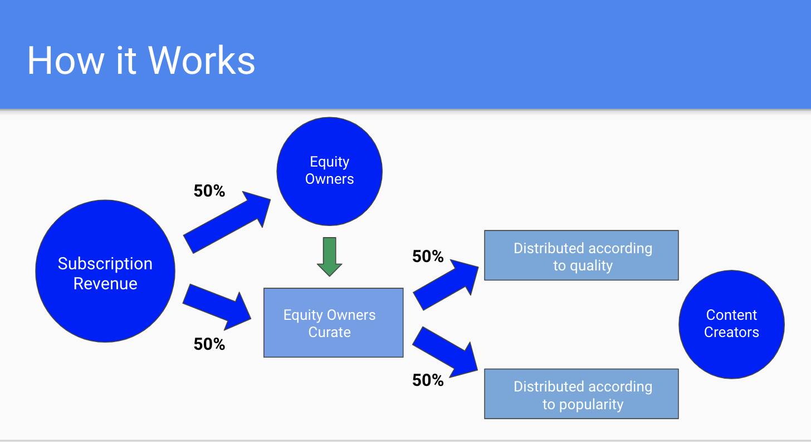

# **Equity Curation Model (ECM)**

Author: 
Michael J. Cohen
[@mjayceee](twitter.com/mjayceee)

October, 2019

### **Problem Summary**
Over the last two decades, **the internet has hollowed out the legacy media business**: print, radio and tv &#8722; no sector has been immune. 

While the consumer has benefited broadly from the enhanced convenience and reduced cost, **the economic benefits have mostly accrued to `aggregators`** &#8722; dominant, winner-take-all platforms with outsized control over the user experience and outsized  economic leverage over creators and publishers. 

Powerful platforms are breeding grounds for perverse incentives **as creators and publishers fight for scraps**. In some cases, quality is deteriorating and, in other cases, quality work is not appropriately compensated. **The media landscape has suffered as a result.**

It's become clear that it's very difficult for creators to capture some or any of the value they create. It's also very difficult to separate the good content from the bad.

### **Possible Approaches**
In an effort to solve some of these digital challenges, **the media industry has been excited about the possibility of directly compensating creators** using micropayments. The ability to transfer value on Ethereum with minimal friction and cost has brought that prospect closer to reality. 

On the subject of curating quality, several projects have proposed **models that require users to "stake" something of value to back up their claims**. Again, Ethereum has made this significantly easier.

But users and publishers won't willingly change their behavior just because some technical feature is now feasible. Struggling digital media **publishers need to build new, superior models where *they* can be the aggregators.** 

While many teams in the space &#8722; Steemit, Civil and Peepeth, among others &#8722; have brought creative solutions to market, no projects have introduced a community equity model: a defined and traceable claim to revenue and value accrual. 

Token economics won't work when distribution is arbitrary or centralized. And legacy business models won't work on new age platforms.

### **Introducing the ECM**

Decentralized protocols offer a potential solution in an industry that is searching for a new business model and a reformed power structure. The ECM is a proposed infrastructure model for **balancing the relationship between platforms and publishers**, while **elevating the overall quality of digital media**. 

Specifically, the ECM aims to:
- use equity ownership to incentivize **consistent and reliable participation** in content curation
- establish a **transparent, dynamic revenue model** to provide predictable income for creators
- implement a mechanism for indirect governance by **rewarding quality content but avoiding censorship**

#### Channels
The building blocks of the ECM are `Content Channels`: feeds of content &#8722; not unlike Subreddits &#8722; dedicated to a subject, community, author or anything else. For a small flat fee, users can subscribe to the collective and access all the content within.

The subscription model isn't new. What's new in the ECM is the equity component. **Each channel has its own capital structure defined by a `Token Bonding Curve` contract**.  The bonding curve rewards the early believers in a channel as the equity token price increases linearly with demand. Equity owners own the rights to 50% of the subscription revenue of the channel.

#### Equity Ownership
Investing in equity may seem similar to staking models that some have proposed for curating content and generating reputation. The difference with the ECM is that participants are trying to *build* value, not preserve it. 

As part of that process, token equity owners are expected to be `active curators`. In fact, they are heavily incentivized to do so. If an equity owner doesn't vote on at least 25% of all content posted in a `fee period`, they are not eligible to collect from the channel's `dividends`. `Voting` is as simple as upvoting or downvoting. 

The 25% threshold could be lowered as the popularity of a channel grows (through some governance process yet to be defined). 

Equity dividends are calculated and made available for distribution every fee period. The `yield` &#8722; calculated by dividing the annualized dividend by the current bonding curve token price &#8722; is **a good metric to use to determine how the community feels about the stability and growth prospects of a channel**. I.e., if a token is trading at 2x the yield of a similar channel, the market is suggesting that the dividend and growth potential of the higher yielding channel are less certain. Think of it as a **community sentiment metric**.

#### Bookmarks
Each subscribing user has five `bookmarks` to dispense per channel per fee period. **This finite reservoir of influence is a major component for calculating payouts to content creators**. Users may give bookmarks to their favorite creator or to a new creator who posted something interesting. They may give a bookmark to a creator who ran a promotion offering some offchain benefit in exchange for a bookmark. Users may not want to give a bookmark to anyone. This is all okay. Bookmarks are supposed to be a **flexible incentive lever for creators to build value** with users. 

#### Content Payouts
Content creators own the rights to 50% of the subscription revenue in a channel. That 50% is divided into two equal parts. 

*Voting Results* 

Half of the content pot is distributed based on the voting results of the equity owners. The formula is simple. If the ratio of upvotes to downvotes for a given post is in the top 80% in the fee period, the creator is paid out for the post (the post payout is a flat, proportional amount paid out to all eligible posts). If the ratio for a post is in the bottom 20%, the creator isn't paid. 

**In this construct, *most* creators will be paid**. But the desire to be in the top 80% in a period should encourage creators to maintain and improve the quality of content.

In addition, creators are limited to one post every 6 hours, preventing them from flooding the channel with content and dominating the feed &#8722; and potentially breaking the fee model.

*Bookmarks*

Half of the content pot is distributed based on the bookmarks a creator receives in a period, calculated as a percentage of total bookmarks in the channel.

**This is an incentive to produce quality content, but also an incentive for creators to promote themselves and the platform**.

> See the revenue diagram <a href="#ref">here</a>.

#### More on Token Bonding Curves

[This article here](https://medium.com/coinmonks/token-bonding-curves-explained-7a9332198e0e) is a more in depth explanation of bonding curves. The important element to understand with respect to the ECM bonding curve, however, is that **token prices scale linearly with supply**, meaning the higher the supply the higher the token price. The bonding curve contract holds a reserve of ether so that it can act as an automatic market maker, transacting for buyers and sellers immediately &#8722; at an algorithmically determined price. 

> Note: The ECM uses a bonding curve formula with a reserve ratio of 50%, meaning the relationship between the growth in supply and price is one-to-one. 

The algorithmic supply-to-price relationship rewards early believers and advocates of a channel and is meant to incentivize investment of time and money into the channel.

#### More on Bookmarks
With 25% of the total channel pot and 50% of the creator pot at stake, bookmarks are essential to any creator’s revenue stream. Bookmark rewards are the incentive for creators to create communities around their channels, to build their followerships and to draw new users into the ecosystem. The opportunity for outsized bookmark revenue (“making it big”) alongside steady rewards for reliable, quality content (top 80% of posts), make for a **balanced revenue and incentive model for creators**.

#### Attracting Users

Any platform that implements the ECM will need to advertise, much like any other content company. But the ECM has an interesting feature that could make the company’s job easier. In the ECM,
- equity owners are incentivized to promote the platform to increase the value of their tokens and dividends
- content creators are incentivized to promote the platform to attract Bookmark revenue as well as to increase the overall pot

This is an important contrast to previous models, because it demonstrates the value in curators and creators being truly *invested* in a platform, as opposed to navigating the arcane guidelines of a closed network, hoping to be compensated.

#### Scaling
Any app using the ECM will require a high level of user interaction. The Ethereum mainnet is ill-suited to this sort of model and some sort of Layer-2 scaling technology will be required. 

# **Reference**

